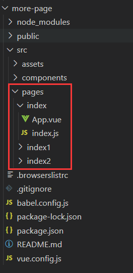

# 根据 vue-cli 修改
## 目录结构

有点类似小程序的风格，每个页面建一个文件夹

## 新建 vue.config.js

~~~ javascript
const path = require('path')
const glob = require('glob')
const START_PATH = '/src/pages/'
const PAGE_PATH = path.resolve(__dirname, '.' + START_PATH)
const entryFiles = glob.sync(PAGE_PATH + '/**/*.js')
let pages = {}

entryFiles.forEach(filePath => {
    let chunk = filePath.split(START_PATH)[1].split("/")[0];
    pages[chunk] = {
        entry: filePath,
        template: 'public/index.html'
    }
})

module.exports = {
    publicPath: './',
    productionSourceMap: false,
    pages
}
~~~
浏览地址：http://localhost:8080/index.html

但是每次新建文件夹，都是要重新运行